# canghe-skills

English | [中文](./README.zh.md)

Skills shared by Canghe for improving daily work efficiency with Claude Code.

## Prerequisites

- Node.js environment installed
- Ability to run `npx bun` commands

## Installation

### Quick Install (Recommended)

```bash
npx skills add freestylefly/canghe-skills
```

### Register as Plugin Marketplace

Run the following command in Claude Code:

```bash
/plugin marketplace add freestylefly/canghe-skills
```

### Install Skills

**Option 1: Via Browse UI**

1. Select **Browse and install plugins**
2. Select **canghe-skills**
3. Select the plugin(s) you want to install
4. Select **Install now**

**Option 2: Direct Install**

```bash
# Install specific plugin
/plugin install content-skills@canghe-skills
/plugin install ai-generation-skills@canghe-skills
/plugin install utility-skills@canghe-skills
```

**Option 3: Ask the Agent**

Simply tell Claude Code:

> Please install Skills from github.com/freestylefly/canghe-skills

### Available Plugins

| Plugin | Description | Skills |
|--------|-------------|--------|
| **content-skills** | Content generation and publishing | [xhs-images](#canghe-xhs-images), [infographic](#canghe-infographic), [cover-image](#canghe-cover-image), [slide-deck](#canghe-slide-deck), [comic](#canghe-comic), [article-illustrator](#canghe-article-illustrator), [post-to-x](#canghe-post-to-x), [post-to-wechat](#canghe-post-to-wechat) |
| **ai-generation-skills** | AI-powered generation backends | [image-gen](#canghe-image-gen), [danger-gemini-web](#canghe-danger-gemini-web) |
| **utility-skills** | Utility tools for content processing | [url-to-markdown](#canghe-url-to-markdown), [danger-x-to-markdown](#canghe-danger-x-to-markdown), [compress-image](#canghe-compress-image), [format-markdown](#canghe-format-markdown), [wechat-article-extractor](#canghe-wechat-article-extractor), [markdown-to-html](#canghe-markdown-to-html), [find-skills](#find-skills), [obsidian-skills](#obsidian-skills), [obsidian-bases](#obsidian-bases), [obsidian-markdown](#obsidian-markdown), [remotion-best-practices](#remotion-best-practices), [skill-creator](#skill-creator) |

## Update Skills

To update skills to the latest version:

1. Run `/plugin` in Claude Code
2. Switch to **Marketplaces** tab (use arrow keys or Tab)
3. Select **canghe-skills**
4. Choose **Update marketplace**

You can also **Enable auto-update** to get the latest versions automatically.

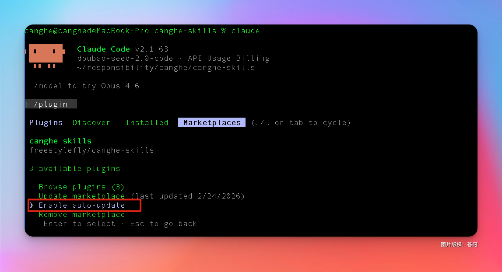

## Available Skills

Skills are organized into three categories:

### Content Skills

Content generation and publishing skills.

#### canghe-xhs-images

Xiaohongshu (RedNote) infographic series generator. Breaks down content into 1-10 cartoon-style infographics with **Style × Layout** two-dimensional system.

```bash
# Auto-select style and layout
/canghe-xhs-images posts/ai-future/article.md

# Specify style
/canghe-xhs-images posts/ai-future/article.md --style notion

# Specify layout
/canghe-xhs-images posts/ai-future/article.md --layout dense

# Combine style and layout
/canghe-xhs-images posts/ai-future/article.md --style tech --layout list

# Direct content input
/canghe-xhs-images 今日星座运势
```

**Styles** (visual aesthetics): `cute` (default), `fresh`, `warm`, `bold`, `minimal`, `retro`, `pop`, `notion`, `chalkboard`

**Style Previews**:

| | | |
|:---:|:---:|:---:|
| 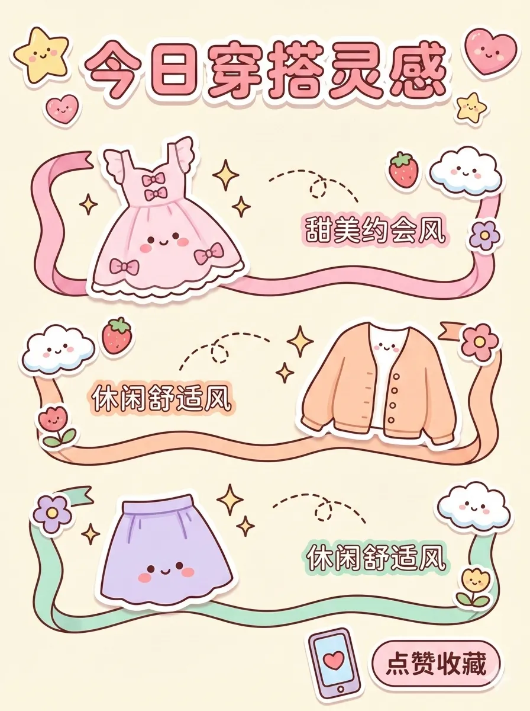 |  |  |
| cute | fresh | warm |
|  |  |  |
| bold | minimal | retro |
|  |  | 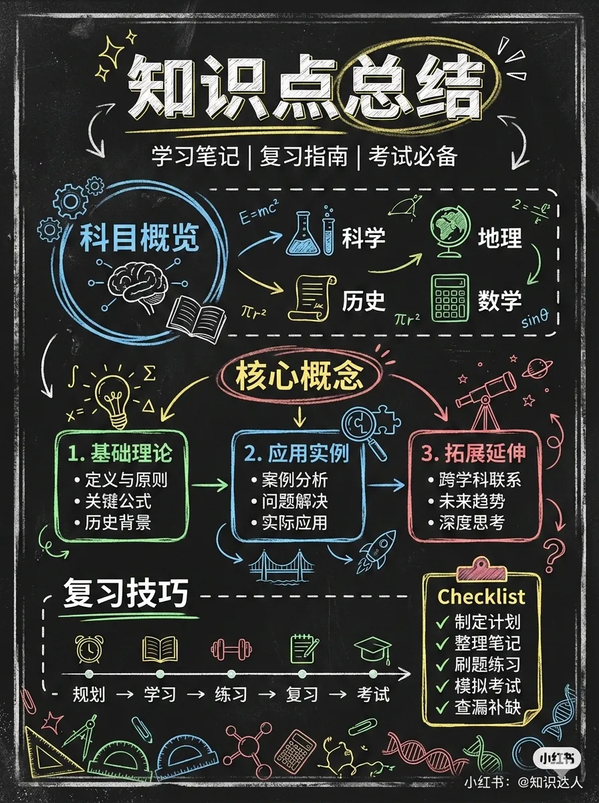 |
| pop | notion | chalkboard |

**Layouts** (information density):
| Layout | Density | Best for |
|--------|---------|----------|
| `sparse` | 1-2 pts | Covers, quotes |
| `balanced` | 3-4 pts | Regular content |
| `dense` | 5-8 pts | Knowledge cards, cheat sheets |
| `list` | 4-7 items | Checklists, rankings |
| `comparison` | 2 sides | Before/after, pros/cons |
| `flow` | 3-6 steps | Processes, timelines |

**Layout Previews**:

| | | |
|:---:|:---:|:---:|
|  |  |  |
| sparse | balanced | dense |
| 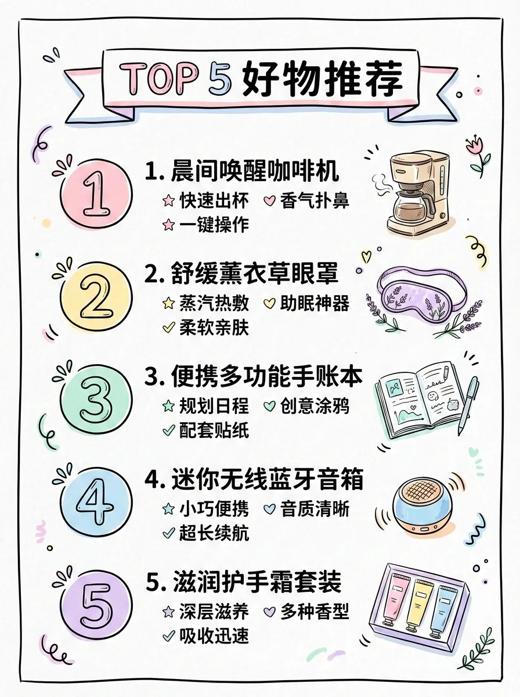 |  | 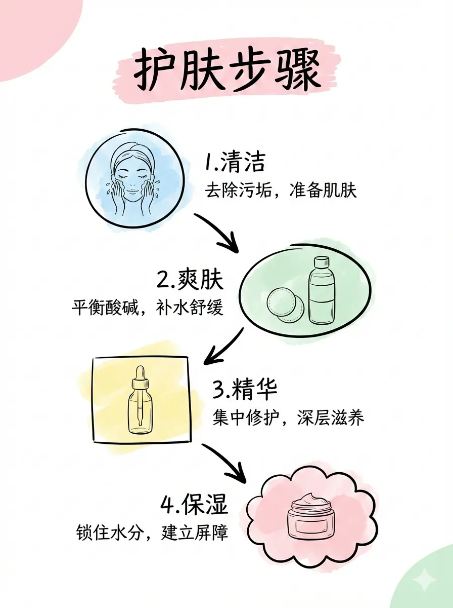 |
| list | comparison | flow |

#### canghe-infographic

Generate professional infographics with 20 layout types and 17 visual styles. Analyzes content, recommends layout×style combinations, and generates publication-ready infographics.

```bash
# Auto-recommend combinations based on content
/canghe-infographic path/to/content.md

# Specify layout
/canghe-infographic path/to/content.md --layout pyramid

# Specify style (default: craft-handmade)
/canghe-infographic path/to/content.md --style technical-schematic

# Specify both
/canghe-infographic path/to/content.md --layout funnel --style corporate-memphis

# With aspect ratio
/canghe-infographic path/to/content.md --aspect portrait
```

**Options**:
| Option | Description |
|--------|-------------|
| `--layout <name>` | Information layout (20 options) |
| `--style <name>` | Visual style (17 options, default: craft-handmade) |
| `--aspect <ratio>` | landscape (16:9), portrait (9:16), square (1:1) |
| `--lang <code>` | Output language (en, zh, ja, etc.) |

**Layouts** (information structure):

| Layout | Best For |
|--------|----------|
| `bridge` | Problem-solution, gap-crossing |
| `circular-flow` | Cycles, recurring processes |
| `comparison-table` | Multi-factor comparisons |
| `do-dont` | Correct vs incorrect practices |
| `equation` | Formula breakdown, input-output |
| `feature-list` | Product features, bullet points |
| `fishbone` | Root cause analysis |
| `funnel` | Conversion processes, filtering |
| `grid-cards` | Multiple topics, overview |
| `iceberg` | Surface vs hidden aspects |
| `journey-path` | Customer journey, milestones |
| `layers-stack` | Technology stack, layers |
| `mind-map` | Brainstorming, idea mapping |
| `nested-circles` | Levels of influence, scope |
| `priority-quadrants` | Eisenhower matrix, 2x2 |
| `pyramid` | Hierarchy, Maslow's needs |
| `scale-balance` | Pros vs cons, weighing |
| `timeline-horizontal` | History, chronological events |
| `tree-hierarchy` | Org charts, taxonomy |
| `venn` | Overlapping concepts |

**Layout Previews**:

| | | |
|:---:|:---:|:---:|
|  |  |  |
| bridge | circular-flow | comparison-table |
| 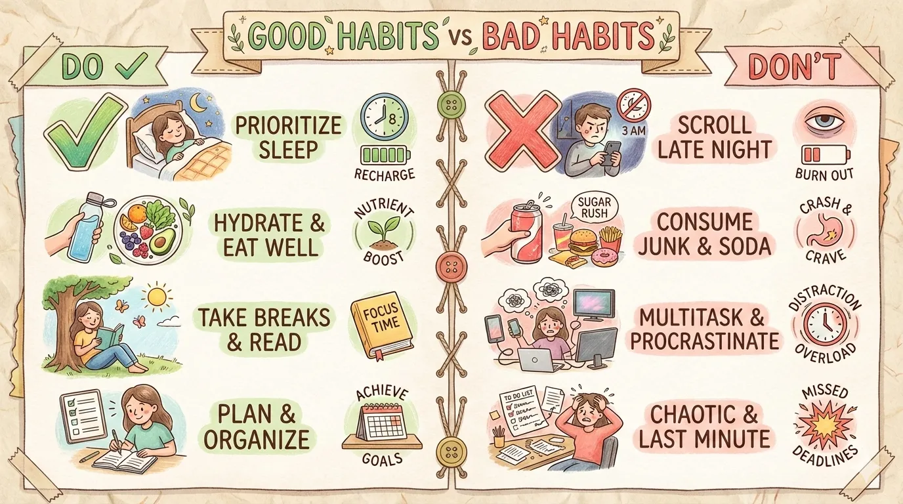 |  | 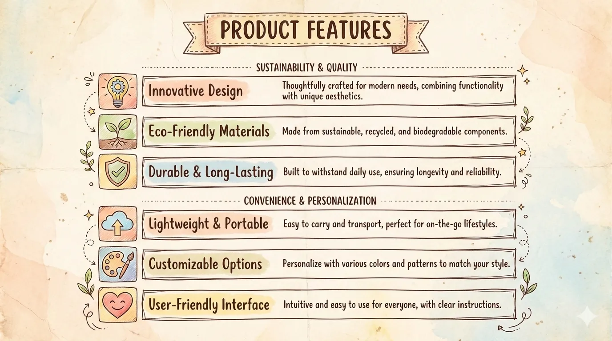 |
| do-dont | equation | feature-list |
| 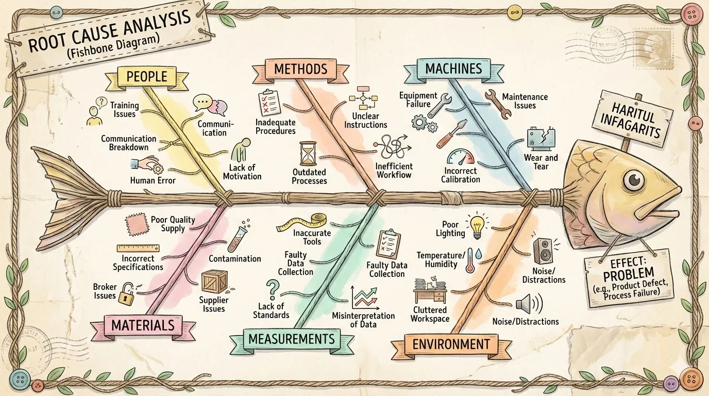 | 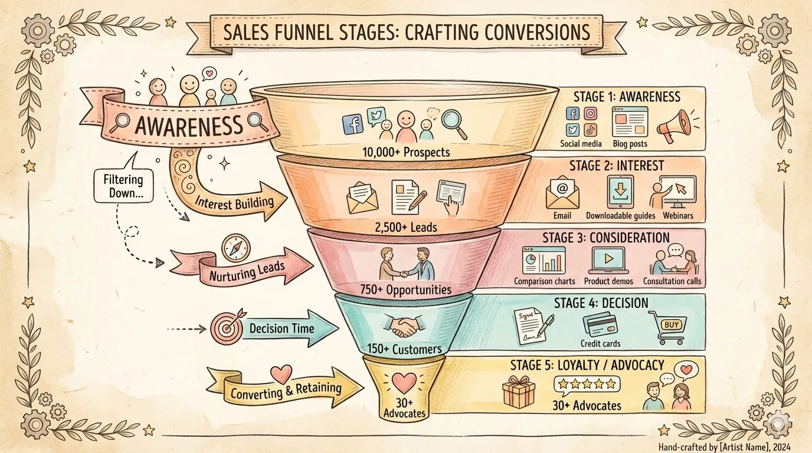 | 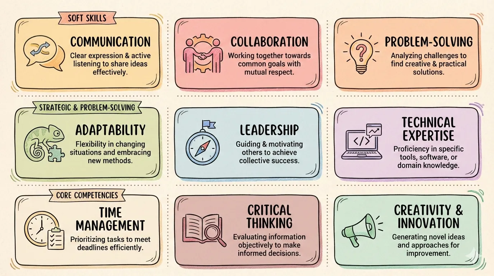 |
| fishbone | funnel | grid-cards |
|  |  |  |
| iceberg | journey-path | layers-stack |
|  | 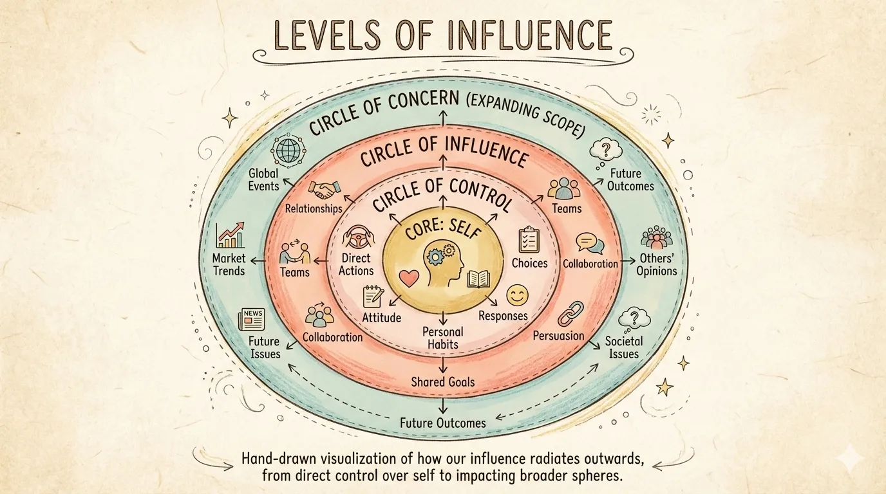 |  |
| mind-map | nested-circles | priority-quadrants |
|  |  |  |
| pyramid | scale-balance | timeline-horizontal |
|  |  | |
| tree-hierarchy | venn | |

**Styles** (visual aesthetics):

| Style | Description |
|-------|-------------|
| `craft-handmade` (Default) | Hand-drawn illustration, paper craft aesthetic |
| `claymation` | 3D clay figures, playful stop-motion |
| `kawaii` | Japanese cute, big eyes, pastel colors |
| `storybook-watercolor` | Soft painted illustrations, whimsical |
| `chalkboard` | Colorful chalk on black board |
| `cyberpunk-neon` | Neon glow on dark, futuristic |
| `bold-graphic` | Comic style, halftone dots, high contrast |
| `aged-academia` | Vintage science, sepia sketches |
| `corporate-memphis` | Flat vector people, vibrant fills |
| `technical-schematic` | Blueprint, isometric 3D, engineering |
| `origami` | Folded paper forms, geometric |
| `pixel-art` | Retro 8-bit, nostalgic gaming |
| `ui-wireframe` | Grayscale boxes, interface mockup |
| `subway-map` | Transit diagram, colored lines |
| `ikea-manual` | Minimal line art, assembly style |
| `knolling` | Organized flat-lay, top-down |
| `lego-brick` | Toy brick construction, playful |

**Style Previews**:

| | | |
|:---:|:---:|:---:|
|  |  |  |
| craft-handmade | claymation | kawaii |
| 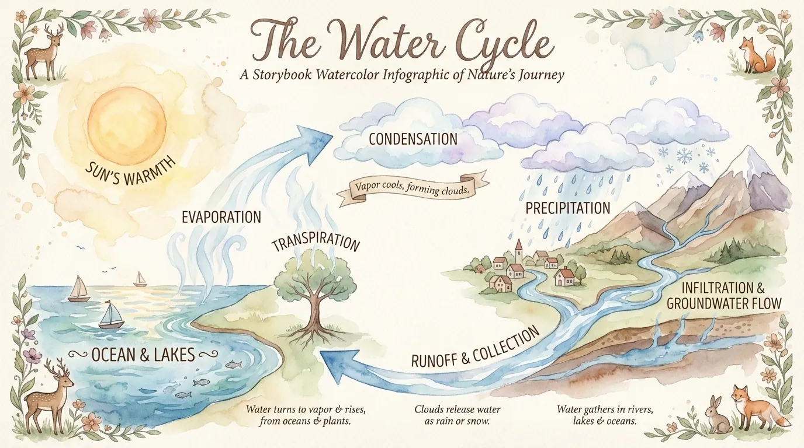 |  |  |
| storybook-watercolor | chalkboard | cyberpunk-neon |
|  |  |  |
| bold-graphic | aged-academia | corporate-memphis |
|  |  |  |
| technical-schematic | origami | pixel-art |
| 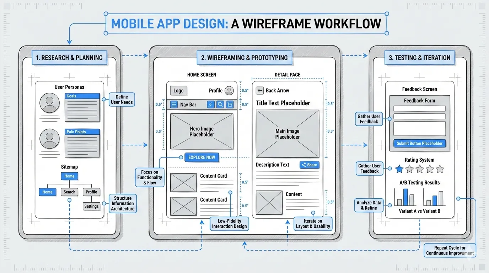 |  |  |
| ui-wireframe | subway-map | ikea-manual |
|  |  | |
| knolling | lego-brick | |

#### canghe-cover-image

Generate cover images for articles with 5 dimensions: Type × Palette × Rendering × Text × Mood. Combines 9 color palettes with 6 rendering styles for 54 unique combinations.

```bash
# Auto-select all dimensions based on content
/canghe-cover-image path/to/article.md

# Quick mode: skip confirmation, use auto-selection
/canghe-cover-image path/to/article.md --quick

# Specify dimensions (5D system)
/canghe-cover-image path/to/article.md --type conceptual --palette cool --rendering digital
/canghe-cover-image path/to/article.md --text title-subtitle --mood bold

# Style presets (backward-compatible shorthand)
/canghe-cover-image path/to/article.md --style blueprint

# Specify aspect ratio (default: 16:9)
/canghe-cover-image path/to/article.md --aspect 2.35:1

# Visual only (no title text)
/canghe-cover-image path/to/article.md --no-title
```

**Five Dimensions**:
- **Type**: `hero`, `conceptual`, `typography`, `metaphor`, `scene`, `minimal`
- **Palette**: `warm`, `elegant`, `cool`, `dark`, `earth`, `vivid`, `pastel`, `mono`, `retro`
- **Rendering**: `flat-vector`, `hand-drawn`, `painterly`, `digital`, `pixel`, `chalk`
- **Text**: `none`, `title-only` (default), `title-subtitle`, `text-rich`
- **Mood**: `subtle`, `balanced` (default), `bold`

#### canghe-slide-deck

Generate professional slide deck images from content. Creates comprehensive outlines with style instructions, then generates individual slide images.

```bash
# From markdown file
/canghe-slide-deck path/to/article.md

# With style and audience
/canghe-slide-deck path/to/article.md --style corporate
/canghe-slide-deck path/to/article.md --audience executives

# Target slide count
/canghe-slide-deck path/to/article.md --slides 15

# Outline only (no image generation)
/canghe-slide-deck path/to/article.md --outline-only

# With language
/canghe-slide-deck path/to/article.md --lang zh
```

**Options**:

| Option | Description |
|--------|-------------|
| `--style <name>` | Visual style: preset name or `custom` |
| `--audience <type>` | Target: beginners, intermediate, experts, executives, general |
| `--lang <code>` | Output language (en, zh, ja, etc.) |
| `--slides <number>` | Target slide count (8-25 recommended, max 30) |
| `--outline-only` | Generate outline only, skip images |
| `--prompts-only` | Generate outline + prompts, skip images |
| `--images-only` | Generate images from existing prompts |
| `--regenerate <N>` | Regenerate specific slide(s): `3` or `2,5,8` |

**Style System**:

Styles are built from 4 dimensions: **Texture** × **Mood** × **Typography** × **Density**

| Dimension | Options |
|-----------|---------|
| Texture | clean, grid, organic, pixel, paper |
| Mood | professional, warm, cool, vibrant, dark, neutral |
| Typography | geometric, humanist, handwritten, editorial, technical |
| Density | minimal, balanced, dense |

**Presets** (pre-configured dimension combinations):

| Preset | Dimensions | Best For |
|--------|------------|----------|
| `blueprint` (default) | grid + cool + technical + balanced | Architecture, system design |
| `chalkboard` | organic + warm + handwritten + balanced | Education, tutorials |
| `corporate` | clean + professional + geometric + balanced | Investor decks, proposals |
| `minimal` | clean + neutral + geometric + minimal | Executive briefings |
| `sketch-notes` | organic + warm + handwritten + balanced | Educational, tutorials |
| `watercolor` | organic + warm + humanist + minimal | Lifestyle, wellness |
| `dark-atmospheric` | clean + dark + editorial + balanced | Entertainment, gaming |
| `notion` | clean + neutral + geometric + dense | Product demos, SaaS |
| `bold-editorial` | clean + vibrant + editorial + balanced | Product launches, keynotes |
| `editorial-infographic` | clean + cool + editorial + dense | Tech explainers, research |
| `fantasy-animation` | organic + vibrant + handwritten + minimal | Educational storytelling |
| `intuition-machine` | clean + cool + technical + dense | Technical docs, academic |
| `pixel-art` | pixel + vibrant + technical + balanced | Gaming, developer talks |
| `scientific` | clean + cool + technical + dense | Biology, chemistry, medical |
| `vector-illustration` | clean + vibrant + humanist + balanced | Creative, children's content |
| `vintage` | paper + warm + editorial + balanced | Historical, heritage |

**Style Previews**:

| | | |
|:---:|:---:|:---:|
| 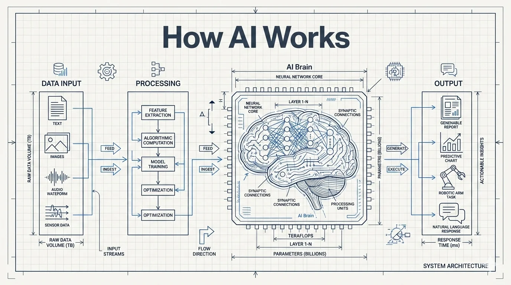 | 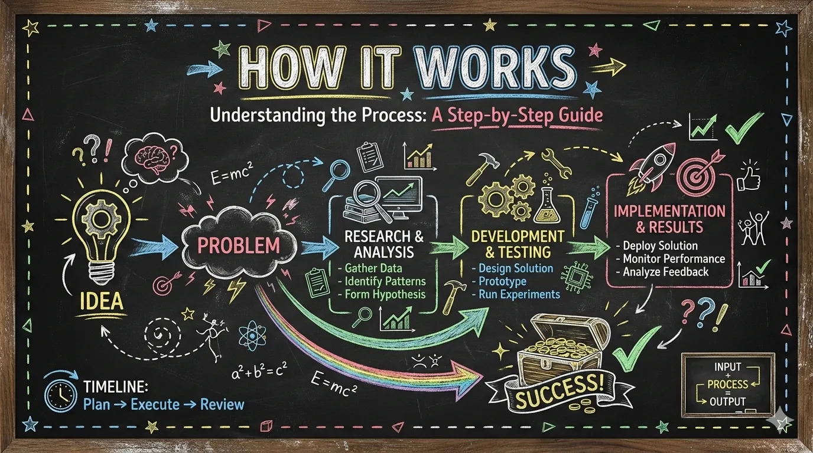 |  |
| blueprint | chalkboard | bold-editorial |
| 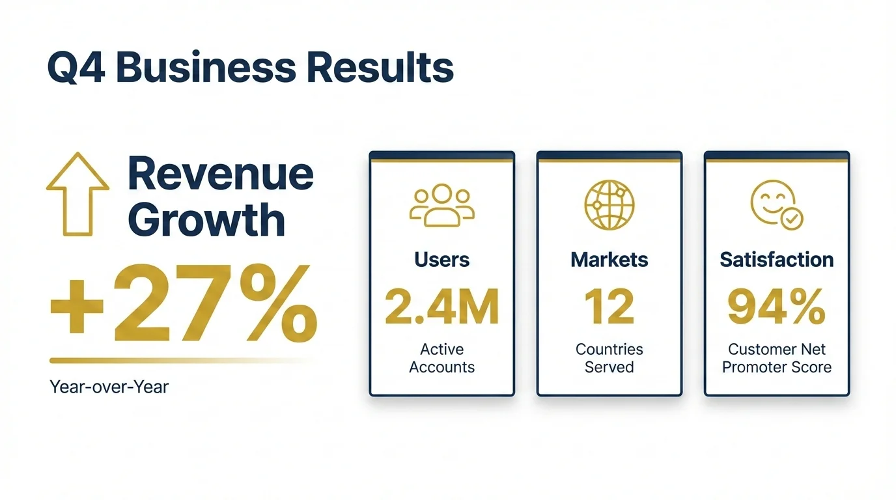 |  |  |
| corporate | dark-atmospheric | editorial-infographic |
| 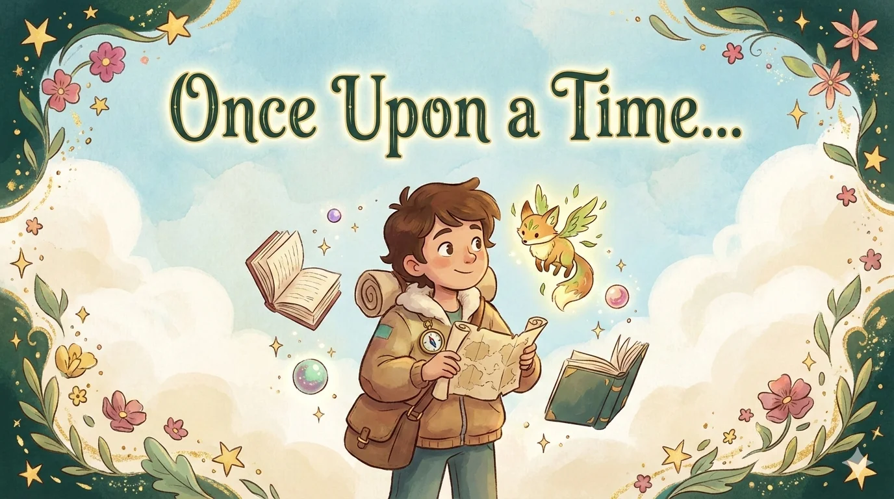 |  |  |
| fantasy-animation | intuition-machine | minimal |
|  |  |  |
| notion | pixel-art | scientific |
|  |  |  |
| sketch-notes | vector-illustration | vintage |
|  | | |
| watercolor | | |

After generation, slides are automatically merged into `.pptx` and `.pdf` files for easy sharing.

#### canghe-comic

Knowledge comic creator with flexible art style × tone combinations. Creates original educational comics with detailed panel layouts and sequential image generation.

```bash
# From source material (auto-selects art + tone)
/canghe-comic posts/turing-story/source.md

# Specify art style and tone
/canghe-comic posts/turing-story/source.md --art manga --tone warm
/canghe-comic posts/turing-story/source.md --art ink-brush --tone dramatic

# Use preset (includes special rules)
/canghe-comic posts/turing-story/source.md --style ohmsha
/canghe-comic posts/turing-story/source.md --style wuxia

# Specify layout and aspect ratio
/canghe-comic posts/turing-story/source.md --layout cinematic
/canghe-comic posts/turing-story/source.md --aspect 16:9

# Specify language
/canghe-comic posts/turing-story/source.md --lang zh

# Direct content input
/canghe-comic "The story of Alan Turing and the birth of computer science"
```

**Options**:
| Option | Values |
|--------|--------|
| `--art` | `ligne-claire` (default), `manga`, `realistic`, `ink-brush`, `chalk` |
| `--tone` | `neutral` (default), `warm`, `dramatic`, `romantic`, `energetic`, `vintage`, `action` |
| `--style` | `ohmsha`, `wuxia`, `shoujo` (presets with special rules) |
| `--layout` | `standard` (default), `cinematic`, `dense`, `splash`, `mixed`, `webtoon` |
| `--aspect` | `3:4` (default, portrait), `4:3` (landscape), `16:9` (widescreen) |
| `--lang` | `auto` (default), `zh`, `en`, `ja`, etc. |

**Art Styles** (rendering technique):

| Art Style | Description |
|-----------|-------------|
| `ligne-claire` | Uniform lines, flat colors, European comic tradition (Tintin, Logicomix) |
| `manga` | Large eyes, manga conventions, expressive emotions |
| `realistic` | Digital painting, realistic proportions, sophisticated |
| `ink-brush` | Chinese brush strokes, ink wash effects |
| `chalk` | Chalkboard aesthetic, hand-drawn warmth |

**Tones** (mood/atmosphere):

| Tone | Description |
|------|-------------|
| `neutral` | Balanced, rational, educational |
| `warm` | Nostalgic, personal, comforting |
| `dramatic` | High contrast, intense, powerful |
| `romantic` | Soft, beautiful, decorative elements |
| `energetic` | Bright, dynamic, exciting |
| `vintage` | Historical, aged, period authenticity |
| `action` | Speed lines, impact effects, combat |

**Presets** (art + tone + special rules):

| Preset | Equivalent | Special Rules |
|--------|-----------|---------------|
| `ohmsha` | manga + neutral | Visual metaphors, NO talking heads, gadget reveals |
| `wuxia` | ink-brush + action | Qi effects, combat visuals, atmospheric elements |
| `shoujo` | manga + romantic | Decorative elements, eye details, romantic beats |

**Layouts** (panel arrangement):
| Layout | Panels/Page | Best for |
|--------|-------------|----------|
| `standard` | 4-6 | Dialogue, narrative flow |
| `cinematic` | 2-4 | Dramatic moments, establishing shots |
| `dense` | 6-9 | Technical explanations, timelines |
| `splash` | 1-2 large | Key moments, revelations |
| `mixed` | 3-7 varies | Complex narratives, emotional arcs |
| `webtoon` | 3-5 vertical | Ohmsha tutorials, mobile reading |

**Layout Previews**:

| | | |
|:---:|:---:|:---:|
|  | 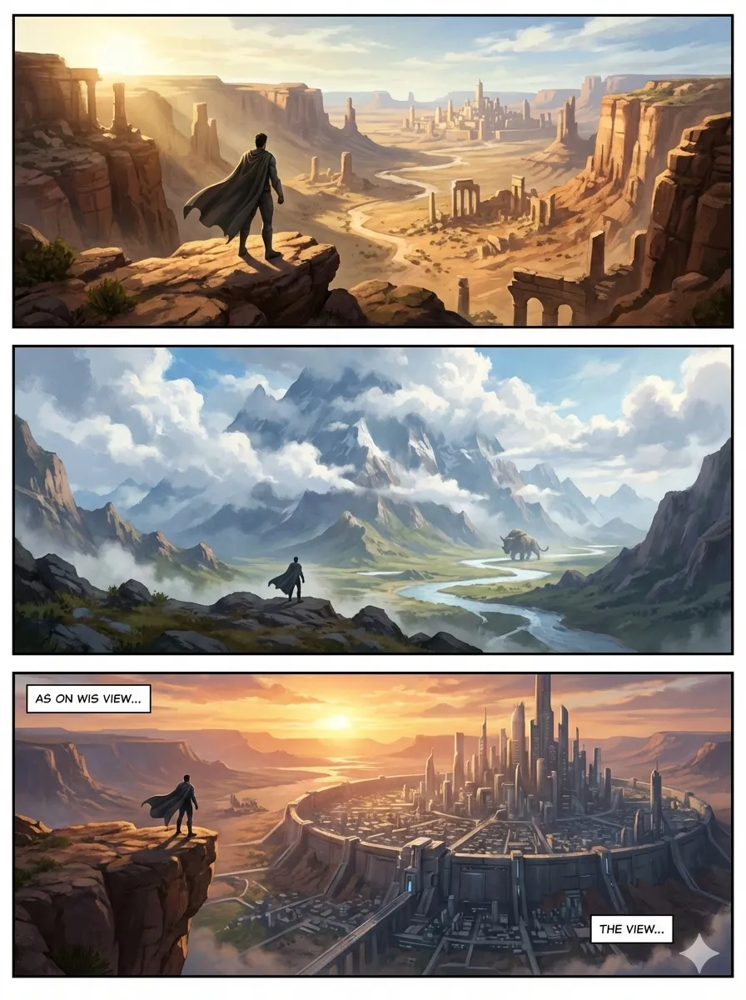 | 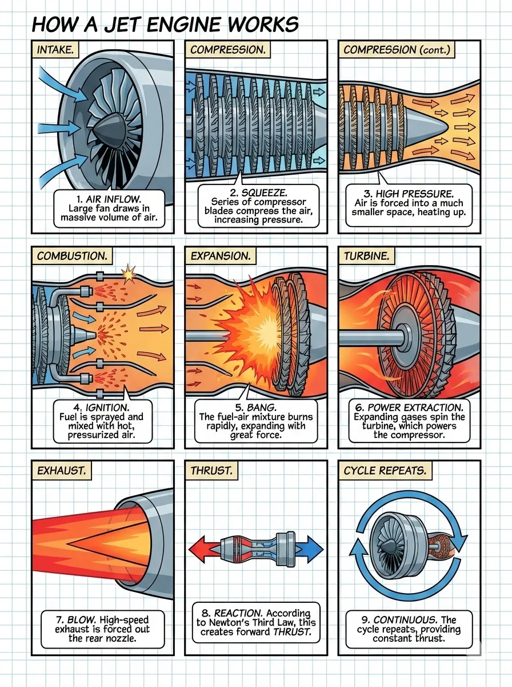 |
| standard | cinematic | dense |
| 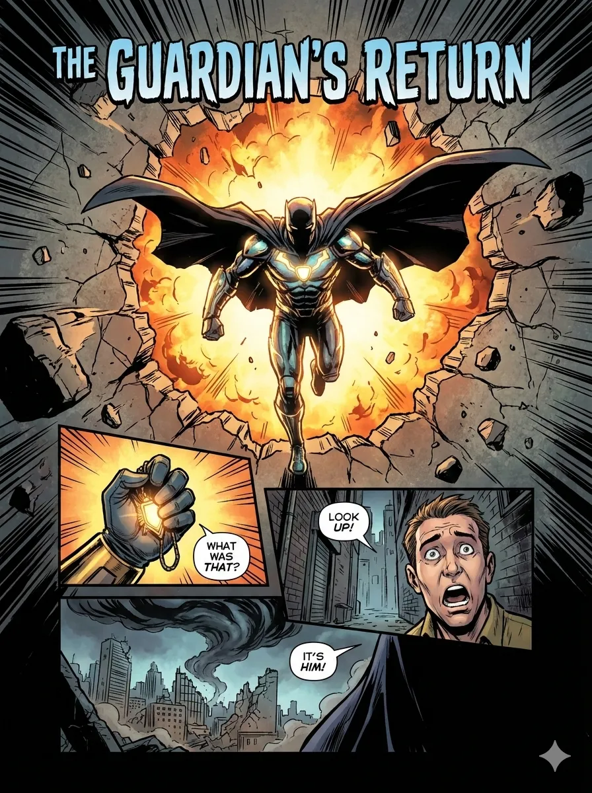 |  |  |
| splash | mixed | webtoon |

#### canghe-article-illustrator

Smart article illustration skill with Type × Style two-dimension approach. Analyzes article structure, identifies positions requiring visual aids, and generates illustrations.

```bash
# Auto-select type and style based on content
/canghe-article-illustrator path/to/article.md

# Specify type
/canghe-article-illustrator path/to/article.md --type infographic

# Specify style
/canghe-article-illustrator path/to/article.md --style blueprint

# Combine type and style
/canghe-article-illustrator path/to/article.md --type flowchart --style notion
```

**Types** (information structure):

| Type | Description | Best For |
|------|-------------|----------|
| `infographic` | Data visualization, charts, metrics | Technical articles, data analysis |
| `scene` | Atmospheric illustration, mood rendering | Narrative, personal stories |
| `flowchart` | Process diagrams, step visualization | Tutorials, workflows |
| `comparison` | Side-by-side, before/after contrast | Product comparisons |
| `framework` | Concept maps, relationship diagrams | Methodologies, architecture |
| `timeline` | Chronological progression | History, project progress |

**Styles** (visual aesthetics):

| Style | Description | Best For |
|-------|-------------|----------|
| `notion` (default) | Minimalist hand-drawn line art | Knowledge sharing, SaaS, productivity |
| `elegant` | Refined, sophisticated | Business, thought leadership |
| `warm` | Friendly, approachable | Personal growth, lifestyle |
| `minimal` | Ultra-clean, zen-like | Philosophy, minimalism |
| `blueprint` | Technical schematics | Architecture, system design |
| `watercolor` | Soft artistic with natural warmth | Lifestyle, travel, creative |
| `editorial` | Magazine-style infographic | Tech explainers, journalism |
| `scientific` | Academic precise diagrams | Biology, chemistry, technical |

**Style Previews**:

| | | |
|:---:|:---:|:---:|
|  | 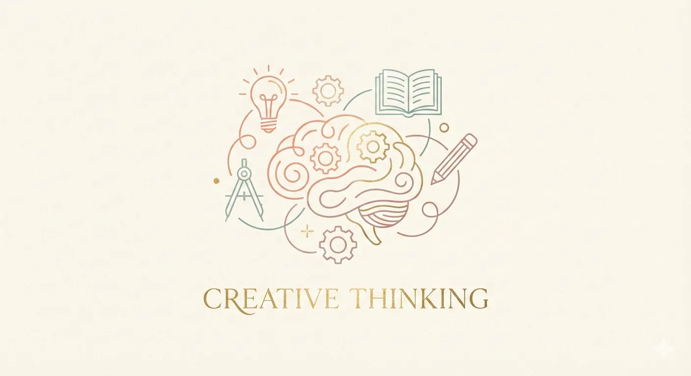 |  |
| notion | elegant | warm |
|  | 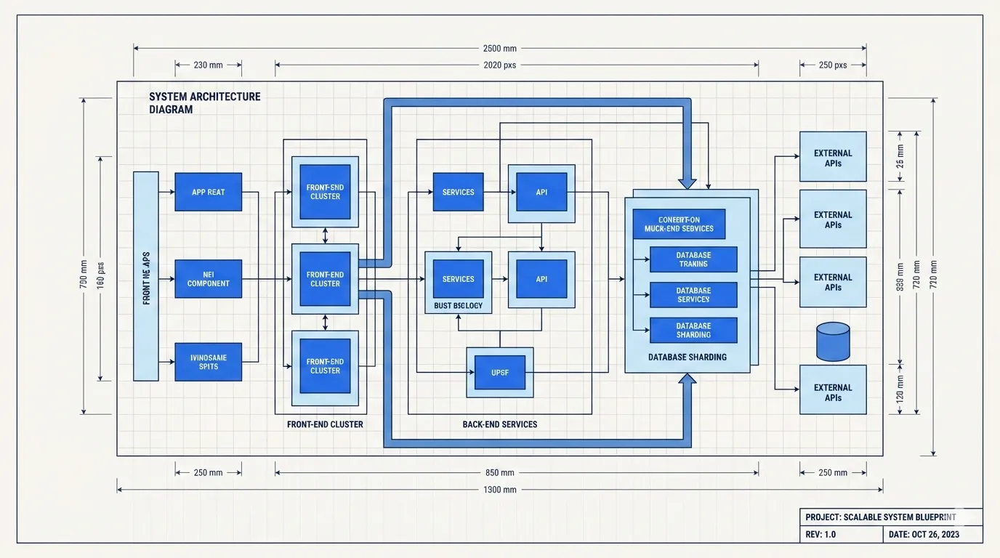 |  |
| minimal | blueprint | watercolor |
|  |  | |
| editorial | scientific | |

#### canghe-post-to-x

Post content and articles to X (Twitter). Supports regular posts with images and X Articles (long-form Markdown). Uses real Chrome with CDP to bypass anti-automation.

```bash
# Post with text
/canghe-post-to-x "Hello from Claude Code!"

# Post with images
/canghe-post-to-x "Check this out" --image photo.png

# Post X Article
/canghe-post-to-x --article path/to/article.md
```

#### canghe-post-to-wechat

Post content to WeChat Official Account (微信公众号). Two modes available:

**Image-Text (贴图)** - Multiple images with short title/content:

```bash
/canghe-post-to-wechat 贴图 --markdown article.md --images ./photos/
/canghe-post-to-wechat 贴图 --markdown article.md --image img1.png --image img2.png --image img3.png
/canghe-post-to-wechat 贴图 --title "标题" --content "内容" --image img1.png --submit
```

**Article (文章)** - Full markdown/HTML with rich formatting:

```bash
/canghe-post-to-wechat 文章 --markdown article.md
/canghe-post-to-wechat 文章 --markdown article.md --theme grace
/canghe-post-to-wechat 文章 --html article.html
```

**Publishing Methods**:

| Method | Speed | Requirements |
|--------|-------|--------------|
| API (Recommended) | Fast | API credentials |
| Browser | Slow | Chrome, login session |

**API Configuration** (for faster publishing):

```bash
# Add to .canghe-skills/.env (project-level) or ~/.canghe-skills/.env (user-level)
WECHAT_APP_ID=your_app_id
WECHAT_APP_SECRET=your_app_secret
```

To obtain credentials:
1. Visit https://developers.weixin.qq.com/platform/
2. Go to: 我的业务 → 公众号 → 开发密钥
3. Create development key and copy AppID/AppSecret
4. Add your machine's IP to the whitelist

**Browser Method** (no API setup needed): Requires Google Chrome. First run opens browser for QR code login (session preserved).

### AI Generation Skills

AI-powered generation backends.

#### canghe-image-gen

AI SDK-based image generation using official OpenAI, Google and DashScope (Aliyun Tongyi Wanxiang) APIs. Supports text-to-image, reference images, aspect ratios, and quality presets.

```bash
# Basic generation (auto-detect provider)
/canghe-image-gen --prompt "A cute cat" --image cat.png

# With aspect ratio
/canghe-image-gen --prompt "A landscape" --image landscape.png --ar 16:9

# High quality (2k)
/canghe-image-gen --prompt "A banner" --image banner.png --quality 2k

# Specific provider
/canghe-image-gen --prompt "A cat" --image cat.png --provider openai

# DashScope (Aliyun Tongyi Wanxiang)
/canghe-image-gen --prompt "一只可爱的猫" --image cat.png --provider dashscope

# With reference images (Google multimodal only)
/canghe-image-gen --prompt "Make it blue" --image out.png --ref source.png
```

**Options**:
| Option | Description |
|--------|-------------|
| `--prompt`, `-p` | Prompt text |
| `--promptfiles` | Read prompt from files (concatenated) |
| `--image` | Output image path (required) |
| `--provider` | `google`, `openai` or `dashscope` (default: google) |
| `--model`, `-m` | Model ID |
| `--ar` | Aspect ratio (e.g., `16:9`, `1:1`, `4:3`) |
| `--size` | Size (e.g., `1024x1024`) |
| `--quality` | `normal` or `2k` (default: normal) |
| `--ref` | Reference images (Google multimodal only) |

**Environment Variables** (see [Environment Configuration](#environment-configuration) for setup):
| Variable | Description | Default |
|----------|-------------|---------|
| `OPENAI_API_KEY` | OpenAI API key | - |
| `GOOGLE_API_KEY` | Google API key | - |
| `DASHSCOPE_API_KEY` | DashScope API key (Aliyun) | - |
| `OPENAI_IMAGE_MODEL` | OpenAI model | `gpt-image-1.5` |
| `GOOGLE_IMAGE_MODEL` | Google model | `gemini-3-pro-image-preview` |
| `DASHSCOPE_IMAGE_MODEL` | DashScope model | `z-image-turbo` |
| `OPENAI_BASE_URL` | Custom OpenAI endpoint | - |
| `GOOGLE_BASE_URL` | Custom Google endpoint | - |
| `DASHSCOPE_BASE_URL` | Custom DashScope endpoint | - |

**Provider Auto-Selection**:
1. If `--provider` specified → use it
2. If only one API key available → use that provider
3. If multiple available → default to Google

#### canghe-danger-gemini-web

Interacts with Gemini Web to generate text and images.

**Text Generation:**

```bash
/canghe-danger-gemini-web "Hello, Gemini"
/canghe-danger-gemini-web --prompt "Explain quantum computing"
```

**Image Generation:**

```bash
/canghe-danger-gemini-web --prompt "A cute cat" --image cat.png
/canghe-danger-gemini-web --promptfiles system.md content.md --image out.png
```

### Utility Skills

Utility tools for content processing.

#### canghe-wechat-article-extractor

Extract metadata and content from WeChat Official Account articles. Parses WeChat article URLs (`mp.weixin.qq.com`) to extract title, author, description, publish time, and content.

```bash
# Auto extract when providing a WeChat article URL
/canghe-wechat-article-extractor https://mp.weixin.qq.com/s/...
```

#### canghe-url-to-markdown

Fetch any URL via Chrome CDP and convert to clean markdown. Supports two capture modes for different scenarios.

```bash
# Auto mode (default) - capture when page loads
/canghe-url-to-markdown https://example.com/article

# Wait mode - for login-required pages
/canghe-url-to-markdown https://example.com/private --wait

# Save to specific file
/canghe-url-to-markdown https://example.com/article -o output.md
```

**Capture Modes**:
| Mode | Description | Best For |
|------|-------------|----------|
| Auto (default) | Captures immediately after page load | Public pages, static content |
| Wait (`--wait`) | Waits for user signal before capture | Login-required, dynamic content |

**Options**:
| Option | Description |
|--------|-------------|
| `<url>` | URL to fetch |
| `-o <path>` | Output file path |
| `--wait` | Wait for user signal before capturing |
| `--timeout <ms>` | Page load timeout (default: 30000) |

#### canghe-danger-x-to-markdown

Converts X (Twitter) content to markdown format. Supports tweet threads and X Articles.

```bash
# Convert tweet to markdown
/canghe-danger-x-to-markdown https://x.com/username/status/123456

# Save to specific file
/canghe-danger-x-to-markdown https://x.com/username/status/123456 -o output.md

# JSON output
/canghe-danger-x-to-markdown https://x.com/username/status/123456 --json

# Download media (images/videos) to local files
/canghe-danger-x-to-markdown https://x.com/username/status/123456 --download-media
```

**Supported URLs:**
- `https://x.com/<user>/status/<id>`
- `https://twitter.com/<user>/status/<id>`
- `https://x.com/i/article/<id>`

**Authentication:** Uses environment variables (`X_AUTH_TOKEN`, `X_CT0`) or Chrome login for cookie-based auth.

#### canghe-compress-image

Compress images to reduce file size while maintaining quality.

```bash
/canghe-compress-image path/to/image.png
/canghe-compress-image path/to/images/ --quality 80
```

#### canghe-format-markdown

Format plain text or markdown files with proper frontmatter, titles, summaries, headings, bold, lists, and code blocks.

```bash
# Format a markdown file
/canghe-format-markdown path/to/article.md

# Format with specific output
/canghe-format-markdown path/to/draft.md
```

**Workflow**:
1. Read source file and analyze content structure
2. Check/create YAML frontmatter (title, slug, summary, coverImage)
3. Handle title: use existing, extract from H1, or generate candidates
4. Apply formatting: headings, bold, lists, code blocks, quotes
5. Save to `{filename}-formatted.md`
6. Run typography script: ASCII→fullwidth quotes, CJK spacing, autocorrect

**Frontmatter Fields**:
| Field | Processing |
|-------|------------|
| `title` | Use existing, extract H1, or generate candidates |
| `slug` | Infer from file path or generate from title |
| `summary` | Generate engaging summary (100-150 chars) |
| `coverImage` | Check for `imgs/cover.png` in same directory |

**Formatting Rules**:
| Element | Format |
|---------|--------|
| Titles | `#`, `##`, `###` hierarchy |
| Key points | `**bold**` |
| Parallel items | `-` unordered or `1.` ordered lists |
| Code/commands | `` `inline` `` or ` ```block``` ` |
| Quotes | `>` blockquote |

#### canghe-markdown-to-html

Converts Markdown files to styled HTML with WeChat-compatible themes. Supports code highlighting, math, PlantUML, footnotes, alerts, and infographics.

```bash
# Basic conversion (uses default theme)
/canghe-markdown-to-html article.md

# With specific theme (default, grace, simple)
/canghe-markdown-to-html article.md --theme grace
```

#### find-skills

A discovery helper for the agent-skills ecosystem. It maps user goals to searchable keywords, finds candidate skills with `npx skills`, and suggests concrete install commands.

#### obsidian-skills

An Obsidian-focused skill bundle for knowledge-work workflows, combining note authoring, structured views, and canvas-based organization in one package.

#### obsidian-bases

Build and maintain Obsidian Bases (`.base`) with reliable YAML structure, including multi-view setups, filter logic, computed formulas, and summary fields.

#### obsidian-markdown

Work with Obsidian Flavored Markdown safely: wikilinks, embeds, callouts, metadata/frontmatter, tags, and other vault-native syntax conventions.

#### remotion-best-practices

A rule-driven reference set for building Remotion videos in React, with patterns for timing, composition design, captions, transitions, assets, and rendering quality.

#### skill-creator

Methodology for designing and iterating skills: compact SKILL.md writing, progressive-loading structure, and clean separation of scripts, references, and assets.

#### Skill Provenance and Personal Repos

Many skills in this repository are adapted from BaoYu's skill work and then refined for local workflows, tooling, and prompt styles. Source repository: [https://github.com/JimLiu/baoyu-skills](https://github.com/JimLiu/baoyu-skills).  
The practical recommendation is to keep a personal skills repository: each person can version their own conventions, templates, scripts, and domain-specific defaults instead of relying on one shared baseline forever.

## Environment Configuration

Some skills require API keys or custom configuration. Environment variables can be set in `.env` files:

**Load Priority** (higher priority overrides lower):
1. CLI environment variables (e.g., `OPENAI_API_KEY=xxx /canghe-image-gen ...`)
2. `process.env` (system environment)
3. `<cwd>/.canghe-skills/.env` (project-level)
4. `~/.canghe-skills/.env` (user-level)

**Setup**:

```bash
# Create user-level config directory
mkdir -p ~/.canghe-skills

# Create .env file
cat > ~/.canghe-skills/.env << 'EOF'
# OpenAI
OPENAI_API_KEY=sk-xxx
OPENAI_IMAGE_MODEL=gpt-image-1.5
# OPENAI_BASE_URL=https://api.openai.com/v1

# Google
GOOGLE_API_KEY=xxx
GOOGLE_IMAGE_MODEL=gemini-3-pro-image-preview
# GOOGLE_BASE_URL=https://generativelanguage.googleapis.com/v1beta

# DashScope (Aliyun Tongyi Wanxiang)
DASHSCOPE_API_KEY=sk-xxx
DASHSCOPE_IMAGE_MODEL=z-image-turbo
# DASHSCOPE_BASE_URL=https://dashscope.aliyuncs.com/api/v1
EOF
```

**Project-level config** (for team sharing):

```bash
mkdir -p .canghe-skills
# Add .canghe-skills/.env to .gitignore to avoid committing secrets
echo ".canghe-skills/.env" >> .gitignore
```

## Customization

All skills support customization via `EXTEND.md` files. Create an extension file to override default styles, add custom configurations, or define your own presets.

**Extension paths** (checked in priority order):
1. `.canghe-skills/<skill-name>/EXTEND.md` - Project-level (for team/project-specific settings)
2. `~/.canghe-skills/<skill-name>/EXTEND.md` - User-level (for personal preferences)

**Example**: To customize `canghe-cover-image` with your brand colors:

```bash
mkdir -p .canghe-skills/canghe-cover-image
```

Then create `.canghe-skills/canghe-cover-image/EXTEND.md`:

```markdown
## Custom Palettes

### corporate-tech
- Primary colors: #1a73e8, #4A90D9
- Background: #F5F7FA
- Accent colors: #00B4D8, #48CAE4
- Decorative hints: Clean lines, subtle gradients
- Best for: SaaS, enterprise, technical
```

The extension content will be loaded before skill execution and override defaults.

## Disclaimer

### canghe-danger-gemini-web

This skill uses the Gemini Web API (reverse-engineered).

**Warning:** This project uses unofficial API access via browser cookies. Use at your own risk.

- First run opens a browser to authenticate with Google
- Cookies are cached for subsequent runs
- No guarantees on API stability or availability

**Supported browsers** (auto-detected): Google Chrome, Chrome Canary/Beta, Chromium, Microsoft Edge

**Proxy configuration**: If you need a proxy to access Google services (e.g., in China), set environment variables inline:

```bash
HTTP_PROXY=http://127.0.0.1:7890 HTTPS_PROXY=http://127.0.0.1:7890 /canghe-danger-gemini-web "Hello"
```

### canghe-danger-x-to-markdown

This skill uses a reverse-engineered X (Twitter) API.

**Warning:** This is NOT an official API. Use at your own risk.

- May break without notice if X changes their API
- Account restrictions possible if API usage detected
- First use requires consent acknowledgment
- Authentication via environment variables or Chrome login

## License

MIT
